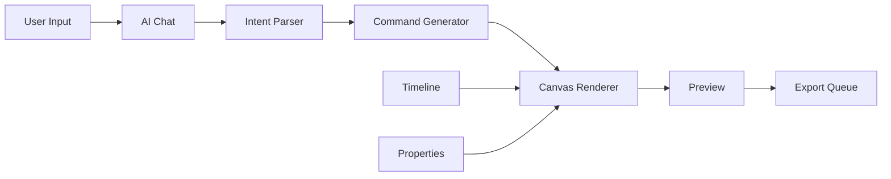

# MotionAI Studio MVP実装計画書

## 1. 技術選定

### 1.1 選定基準
- **開発速度**: MVPを3ヶ月で完成させる
- **拡張性**: 将来的な機能追加が容易
- **パフォーマンス**: リアルタイムプレビューが可能
- **コスト**: 初期投資を最小限に
- **学習曲線**: 既存の知識を活用可能

### 1.2 最終技術スタック

#### フロントエンド
```javascript
{
  "framework": "Electron 28.x + React 18.x",
  "rendering": "Konva.js", // Canvas APIベース、高速で安定
  "animation": "Framer Motion + custom engine",
  "state": "Zustand", // 軽量で学習曲線が低い
  "ui": "Mantine UI", // コンポーネント豊富、カスタマイズ性高
  "bundler": "Vite" // 高速ビルド
}
```

**選定理由**:
- **Konva.js**: Three.jsより軽量で2D特化、既存のCanvasナレッジを活用可能
- **Mantine UI**: Radix UIより完成度が高く、開発速度向上
- **Zustand**: Reduxより簡潔で、小規模プロジェクトに最適

#### バックエンド/AI
```javascript
{
  "runtime": "Node.js 20.x",
  "framework": "Fastify", // Expressより高速
  "ai": {
    "llm": "OpenAI GPT-4 Turbo API",
    "embedding": "OpenAI text-embedding-3-small",
    "localML": "ONNX Runtime" // TensorFlow.jsより軽量
  },
  "media": "fluent-ffmpeg", // FFmpegのNode.jsラッパー
  "database": "SQLite + Prisma ORM"
}
```

**選定理由**:
- **Fastify**: パフォーマンスとDXのバランスが良い
- **ONNX Runtime**: クロスプラットフォーム対応、軽量
- **Prisma**: TypeScript親和性が高く、マイグレーション管理が楽

#### 開発環境
```javascript
{
  "language": "TypeScript 5.x",
  "testing": "Vitest + Testing Library",
  "linting": "Biome", // ESLint+Prettierより高速
  "cicd": "GitHub Actions",
  "monitoring": "Sentry (エラー) + PostHog (分析)"
}
```

## 2. アーキテクチャ設計

### 2.1 全体構成
```
┌────────────────────────────────────────────────────┐
│                  Electron Main Process              │
│  ┌──────────────┐  ┌─────────────┐  ┌──────────┐  │
│  │ File Manager │  │ FFmpeg      │  │ IPC      │  │
│  │              │  │ Controller  │  │ Handler  │  │
│  └──────────────┘  └─────────────┘  └──────────┘  │
└────────────────────────────────────────────────────┘
                           │
┌────────────────────────────────────────────────────┐
│                 Electron Renderer Process           │
│  ┌─────────────────────────────────────────────┐  │
│  │                React Application              │  │
│  │  ┌─────────┐  ┌──────────┐  ┌────────────┐ │  │
│  │  │ Editor  │  │ Preview  │  │ AI Chat    │ │  │
│  │  │ Panel   │  │ Canvas   │  │ Interface  │ │  │
│  │  └─────────┘  └──────────┘  └────────────┘ │  │
│  └─────────────────────────────────────────────┘  │
└────────────────────────────────────────────────────┘
                           │
┌────────────────────────────────────────────────────┐
│                   Local Services                    │
│  ┌──────────────┐  ┌─────────────┐  ┌──────────┐  │
│  │ AI Service   │  │ Render      │  │ Asset    │  │
│  │ (Fastify)    │  │ Queue       │  │ Cache    │  │
│  └──────────────┘  └─────────────┘  └──────────┘  │
└────────────────────────────────────────────────────┘
```

### 2.2 データフロー


## 3. MVP機能スコープ

### 3.1 実装する機能（Must Have）

#### Phase 1-A: 基盤構築（Week 1-2）
- [ ] Electronアプリケーション基本構造
- [ ] React + Konva.js統合
- [ ] 基本UIレイアウト（パネル分割）
- [ ] プロジェクトファイル管理

#### Phase 1-B: 図形生成（Week 3-4）
- [ ] 基本図形ツール（円、四角、多角形）
- [ ] 図形プロパティ編集（色、サイズ、位置）
- [ ] レイヤーシステム
- [ ] 選択・変形ツール

#### Phase 1-C: AIチャット基本（Week 5-6）
- [ ] チャットUI実装
- [ ] OpenAI API統合
- [ ] 基本的なプロンプト解析
- [ ] 図形生成コマンド（"赤い円を作って"）

#### Phase 1-D: アニメーション（Week 7-8）
- [ ] キーフレームシステム
- [ ] 基本イージング（linear, ease-in-out）
- [ ] 位置・回転・スケールアニメーション
- [ ] タイムライン UI

#### Phase 1-E: エクスポート（Week 9-10）
- [ ] MP4エクスポート（720p）
- [ ] プレビュー再生機能
- [ ] 基本的なレンダリング設定

#### Phase 1-F: 安定化・最適化（Week 11-12）
- [ ] バグ修正
- [ ] パフォーマンス最適化
- [ ] 基本的なエラーハンドリング
- [ ] インストーラー作成

### 3.2 実装しない機能（Nice to Have）
- 高度なエフェクト（グロー、ブラー等）
- 音楽連動機能
- コラボレーション
- 3D機能
- プラグインシステム

## 4. 詳細実装計画

### Week 1-2: プロジェクト基盤

#### タスク詳細
```typescript
// 1. プロジェクト初期化
- create-electron-app でテンプレート生成
- TypeScript設定
- Vite + React統合
- 基本的なIPC通信設定

// 2. UI基本構造
interface Layout {
  sidebar: ToolPanel;
  canvas: PreviewArea;
  timeline: TimelinePanel;
  properties: PropertiesPanel;
  chat: ChatPanel;
}

// 3. 状態管理設計
interface AppState {
  project: Project;
  selection: Selection;
  timeline: Timeline;
  chat: ChatHistory;
}
```

#### 成果物
- 起動可能なElectronアプリ
- 基本的なパネルレイアウト
- プロジェクト保存/読み込み機能

### Week 3-4: 図形生成システム

#### コア実装
```typescript
// Shape システム
abstract class Shape {
  id: string;
  type: ShapeType;
  properties: ShapeProperties;
  transform: Transform;
  
  abstract render(ctx: Konva.Context): void;
}

// Shape Factory
class ShapeFactory {
  static create(type: string, props: any): Shape {
    switch(type) {
      case 'circle': return new Circle(props);
      case 'rect': return new Rectangle(props);
      case 'polygon': return new Polygon(props);
    }
  }
}

// Layer Manager
class LayerManager {
  layers: Layer[] = [];
  activeLayer: string;
  
  addShape(shape: Shape): void;
  removeShape(id: string): void;
  reorderLayers(from: number, to: number): void;
}
```

#### UI実装
- ツールバー（選択、図形ツール）
- プロパティパネル（色、サイズ、位置）
- レイヤーパネル

### Week 5-6: AI統合

#### プロンプト解析システム
```typescript
// Intent Parser
interface ParsedIntent {
  action: 'create' | 'modify' | 'animate';
  target: {
    type: string;
    properties: Record<string, any>;
  };
  modifiers?: {
    position?: string;
    animation?: string;
  };
}

// プロンプト例と解析
"赤い円を中央に配置" → {
  action: 'create',
  target: { type: 'circle', properties: { fill: 'red' } },
  modifiers: { position: 'center' }
}

// Command Executor
class CommandExecutor {
  execute(intent: ParsedIntent): void {
    switch(intent.action) {
      case 'create':
        this.createShape(intent);
        break;
      case 'modify':
        this.modifySelection(intent);
        break;
    }
  }
}
```

#### OpenAI統合
```typescript
// System Prompt
const SYSTEM_PROMPT = `
あなたはモーショングラフィックス編集アシスタントです。
ユーザーの自然言語による指示を解析し、以下の形式で返してください：

{
  "action": "create|modify|animate",
  "target": {
    "type": "circle|rect|polygon",
    "properties": { /* 図形のプロパティ */ }
  },
  "modifiers": { /* 位置やアニメーション */ }
}
`;
```

### Week 7-8: アニメーションシステム

#### キーフレーム実装
```typescript
interface Keyframe {
  time: number; // ms
  properties: Partial<ShapeProperties>;
  easing: EasingFunction;
}

class AnimationTrack {
  shapeId: string;
  keyframes: Keyframe[] = [];
  
  addKeyframe(time: number, props: any): void;
  interpolate(time: number): ShapeProperties;
}

// Timeline Manager
class Timeline {
  duration: number = 5000; // 5秒
  currentTime: number = 0;
  tracks: Map<string, AnimationTrack> = new Map();
  
  play(): void;
  pause(): void;
  seek(time: number): void;
}
```

#### タイムラインUI
- スクラバー
- トラック表示
- キーフレームマーカー

### Week 9-10: エクスポート機能

#### レンダリングパイプライン
```typescript
class Renderer {
  canvas: HTMLCanvasElement;
  
  async renderFrame(time: number): Promise<ImageData> {
    // 1. タイムラインを指定時刻に設定
    // 2. すべてのシェイプを描画
    // 3. ImageDataを返す
  }
  
  async exportVideo(settings: ExportSettings): Promise<void> {
    const frames: Buffer[] = [];
    
    for (let t = 0; t < timeline.duration; t += 1000/30) {
      const imageData = await this.renderFrame(t);
      frames.push(await this.encodeFrame(imageData));
    }
    
    await FFmpeg.createVideo(frames, settings);
  }
}
```

### Week 11-12: 品質向上

#### 最適化項目
- [ ] Canvas描画の最適化（ダーティリージョン）
- [ ] メモリリーク対策
- [ ] 非同期処理の最適化
- [ ] ファイルサイズ削減

#### テスト実装
```typescript
// Unit Tests
describe('ShapeFactory', () => {
  it('should create circle with correct properties', () => {
    const circle = ShapeFactory.create('circle', { 
      radius: 50, 
      fill: 'red' 
    });
    expect(circle.type).toBe('circle');
    expect(circle.properties.radius).toBe(50);
  });
});

// Integration Tests
describe('AI Command Execution', () => {
  it('should create shape from natural language', async () => {
    const result = await aiService.parse('赤い円を作って');
    const shape = commandExecutor.execute(result);
    expect(shape.properties.fill).toBe('red');
  });
});
```

## 5. リスク管理

### 5.1 技術的リスクと対策

| リスク | 影響度 | 対策 |
|-------|--------|------|
| Konva.jsのパフォーマンス限界 | 高 | WebGLレンダラーへの移行準備 |
| AI応答の精度不足 | 中 | プロンプトエンジニアリング改善 |
| Electron起動時間 | 低 | Code Signingとビルド最適化 |

### 5.2 スケジュールリスク

- **バッファ期間**: 各フェーズに20%のバッファを設定
- **優先順位**: エクスポート機能は最悪手動対応可能
- **段階的リリース**: 内部アルファ版を8週目に準備

## 6. 開発環境セットアップ

### 6.1 必要なツール
```bash
# 開発環境構築
npm create electron-app@latest motion-ai-studio -- --template=vite-typescript
cd motion-ai-studio
npm install konva react-konva framer-motion zustand
npm install @mantine/core @mantine/hooks
npm install openai fluent-ffmpeg
npm install -D @types/node vitest @testing-library/react
```

### 6.2 プロジェクト構造
```
motion-ai-studio/
├── src/
│   ├── main/           # Electronメインプロセス
│   ├── renderer/       # React アプリ
│   │   ├── components/
│   │   ├── services/
│   │   ├── stores/
│   │   └── utils/
│   ├── shared/         # 共通型定義
│   └── preload/        # Preload scripts
├── assets/
├── tests/
└── build/
```

## 7. 成功指標（MVP）

### 定量的指標
- [ ] 起動時間: 3秒以内
- [ ] 図形生成応答: 1秒以内
- [ ] エクスポート速度: リアルタイムの2倍速以上
- [ ] メモリ使用量: 500MB以下

### 定性的指標
- [ ] 5つの基本的なユースケースが実行可能
- [ ] クラッシュなしで30分連続使用可能
- [ ] 初見ユーザーが5分以内に図形アニメーション作成可能

## 8. 次のアクション

### 即時実行項目（今週中）
1. GitHubリポジトリ作成
2. 開発環境構築
3. 基本的なElectronアプリ作成
4. OpenAI APIキー取得
5. デザインモックアップ作成

### Week 1 開始時
1. スプリント計画会議
2. タスクをGitHub Projectsに登録
3. CI/CD パイプライン構築
4. 日次スタンドアップ開始